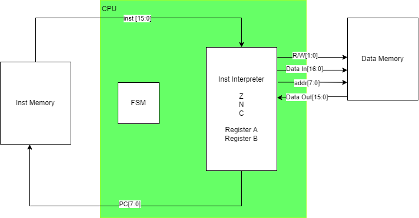

# S-Machine_CPU
A simple 16 bit Instruction set Architecture for a CPU known as the S-Machine

• 16-bit CPU

• Example of a load-store machine

• Two 16-bit arithmetic registers

• Range of operations (+, -, &, |,
and )

• Up to 256 16-bit instructions

• Up to 512 16-bit data values

# Instruction Set

# TODO

FSM.tcl

FSM.do

CPU.tcl

CPU.do

Add br

Fool with Timing

Test a lot

Devices?

