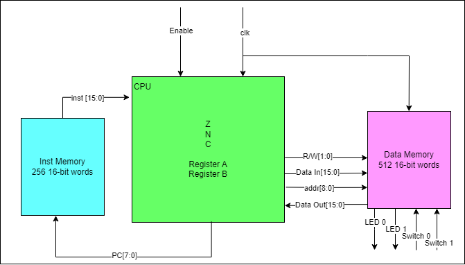

# S-Machine_CPU
A simple 16-bit Instruction set Architecture for a CPU known as the 'S-Machine'

By Duncan Cameron and Jasper Grant

Project by Larry Hughes

• 16-bit CPU

• Example of a load-store machine

• Two 16-bit arithmetic registers

• Range of operations (+, -, AND, OR,
and XOR)

• Up to 256 16-bit instructions

• Up to 512 16-bit data values

# Instruction Set

# Initial Results

## Tests

### Test 0
Enable is turned off for 20ns
### Test 1
Load 1 immediate into registers A and B
### Test 2
Add value of registers together into register A (1+1=2)
### Test 3
Subtract value of registers together into register A (2-1=1)
### Test 4
Increment register B by 1 (1+1=2)
### Test 5
OR value of registers (1|2=3)
### Test 6
AND value of registers (2&3=2)
### Test 7
XOR value of registers (2^2=0)
### Test 8
Store value of register B in 10101010
### Test 9
Load value of 01010101 into register A
### Test 10
Shift right value of register A twice (2>>1=1)(1>>1=0)
### Test 11
Exchange values of registers A and B (0,2->2,0)
### Test 12
Compare values of registers twice with an exhange in between (2-0)(EXCH)(0-2)
### Test 13
Move register A into register B (B<-0)
### Test 14
Set all ZNC bits
### Test 15
Clear all ZNC bits
### Test 16
Increment and then subtract registers to values A=-2 and B=1 then Add 1, next loop to address of add 1 if Z or N bits are set. They will be because of the -1 in register A, then Add 1, next loop to address of add 1 if Z or N bits are set. They will be because of the 0 in register A, then Add 1, next loop to address of add 1 if Z or N bits are set. They will not be because of the 1 in register A

Annotated version to be added closer to the project's due date

