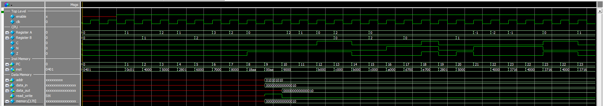

# S-Machine_CPU
A simple 16-bit Instruction set Architecture for a CPU known as the 'S-Machine'

By Duncan Cameron and Jasper Grant

Project by Larry Hughes

This project is an implementation of Larry Hughes’s S-Machine. The S-Machine is a Central Processing Unit (CPU) that contains a 16-bit instruction set of 15 instructions. It is a load-store machine meaning registers must be loaded from memory before being used in algebraic or logical operations. This implementation uses a Harvard architecture meaning that data and instruction memories are separate. The S-Machine also features two registers A and B, and three status bits carry, negative, and zero. To prove the successful operation of this S-Machine a series of 22 tests were performed to test the separate instructions and possible applications. In addition to these tests’ successful results, success was also found in synthesizing the S-Machine on a DE1-SOC FPGA board, and results were observable through included direct memory access (DMA) devices.

# Design
The design of the S-Machine was optimized for usability and simplicity over faithfulness to an existing CPU. While a real CPU implements fetch, decode, and execute stages over multiple cycles, this S-Machine instead runs an entire instruction execution inside one clock cycle. This architecture change comes from implementing a finite state machine to pass program counter and instruction executed signals, only to realize these operations could simply be periodic on a clock cycle.

The main execution happening on each clock cycle is reading in the current 16-bit instruction, and then using a long switch case to decode the instruction. In the same cycle the instruction is then executed based on parameters and changes are made to the registers A and B along with status bits C, N, and Z all stored inside the CPU. The CPU only changes outputs when PC is incremented or branched, or when data memory is accessed for reading or writing.
 
## Instructions

Instruction decoding and executing were wrapped into a single stage in this implementation of the S-Machine. This was done because the only reason to do these steps separately is to emulate the clock cycles of a real CPU. Due to the accuracy of a real machine not being a priority, it was decided this would not be needed.

 The only change made to the instructions, as written, was adding a 9-bit address to LD and ST when referring to memory. This brings the data memory up to the requested 512 words although it is interesting to note that no more than 256 words of data memory can ever be written to in a single machine code program. This could be fixed by either upgrading the instruction memory to 512 words, adding a pointer functionality, or switching to a Princeton.

## Instruction Memory
The instruction memory of this project is very simple. Its storage mechanism is a 256 16-bit word register. It takes a PC and returns the instruction at this address. Due to the Harvard architecture and no component waiting solely for new instructions, from instruction memory, this component can be asynchronous and process the next instruction as soon as it receives a PC. A priority was made throughout this project to make the writing and loading of the S-Machine machine code practical and intuitive. It is for this reason that the instruction memory is loaded from a text file that allows comments along with the binary. Changing the machine code run by the S-Machine is as easy as changing the file name to be loaded into instruction memory.
## Data Memory
The data memory of this project is also incredibly simple. Its storage mechanism is a 512 16-bit word register. From the CPU side, an address, a read/write value, and data in/out buses are provided to the data memory. The data memory then makes the choice illustrated in the following diagram to decide how to proceed. The data memory also handles device changes at this level. It only writes to input device addresses in this decision-making process although it is constantly reading from input devices.
 
 
## Branching Logic
The branching logic of this implementation of the S-Machine follows the provided pseudocode. It should be noted that this pseudocode means that when bit 11 is not set, the C, N, and Z bits must match bits [10:8] of the instruction exactly to allow a branch. This is an asymmetrical design because when bit 11 (the NOT flag) is set, all three bits C, N, and Z bits do not have to be inverse of bits [10:8]. Only one needs to be inverse. It should also be noted that the two cases for unconditional branching are provided although this seems to only increase confusion by providing two instructions that do the same thing. The branching logic is illustrated in the following flow chart.

 
## Devices
A feature of this S-Machine implementation outside the scope of the original project is the added device support. The devices are implemented with direct memory access (DMA) meaning each device has a dedicated address in memory. The input device’s addresses contain binary values based on the reading of the chosen pin, and the output devices reflect the output values of the chosen pins based on what binary values have been loaded into their addresses. The current implementation is two LEDs and two switches to easily emulate logical gates.
 

## Tests

### Test 0
Enable is turned off for 20ns
### Test 1
Load 1 immediate into registers A and B
### Test 2
Add value of registers together into register A (1+1=2)
### Test 3
Subtract value of registers together into register A (2-1=1)
### Test 4
Increment register B by 1 (1+1=2)
### Test 5
OR value of registers (1|2=3)
### Test 6
AND value of registers (2&3=2)
### Test 7
XOR value of registers (2^2=0)
### Test 8
Store value of register B in 10101010
### Test 9
Load value of 01010101 into register A
### Test 10
Shift right value of register A twice (2>>1=1)(1>>1=0)
### Test 11
Exchange values of registers A and B (0,2->2,0)
### Test 12
Compare values of registers twice with an exhange in between (2-0)(EXCH)(0-2)
### Test 13
Move register A into register B (B<-0)
### Test 14
Set all ZNC bits
### Test 15
Clear all ZNC bits
### Test 16
Increment and then subtract registers to values A=-2 and B=1 then Add 1, next loop to address of add 1 if Z or N bits are set. They will be because of the -1 in register A, then Add 1, next loop to address of add 1 if Z or N bits are set. They will be because of the 0 in register A, then Add 1, next loop to address of add 1 if Z or N bits are set. They will not be because of the 1 in register A
